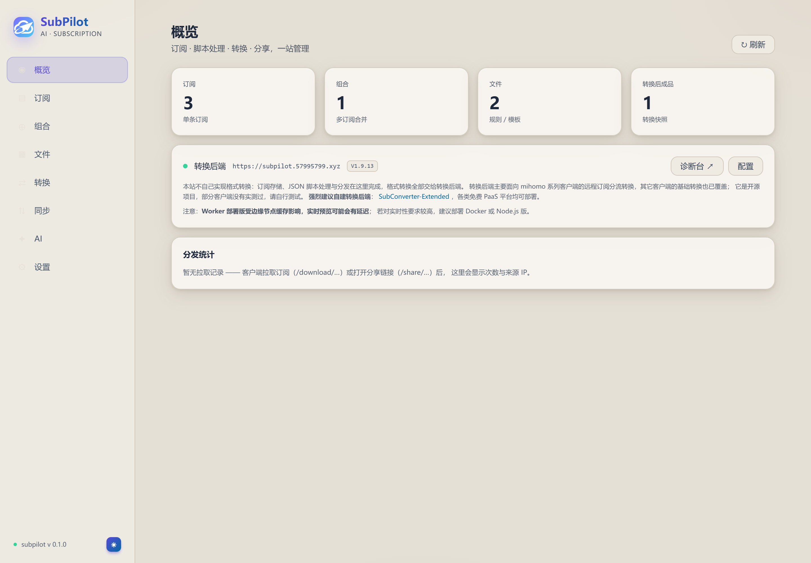
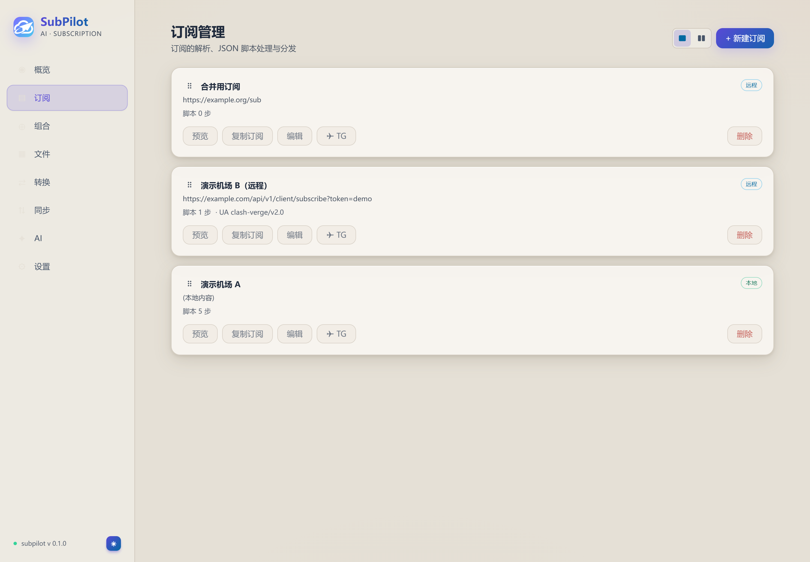
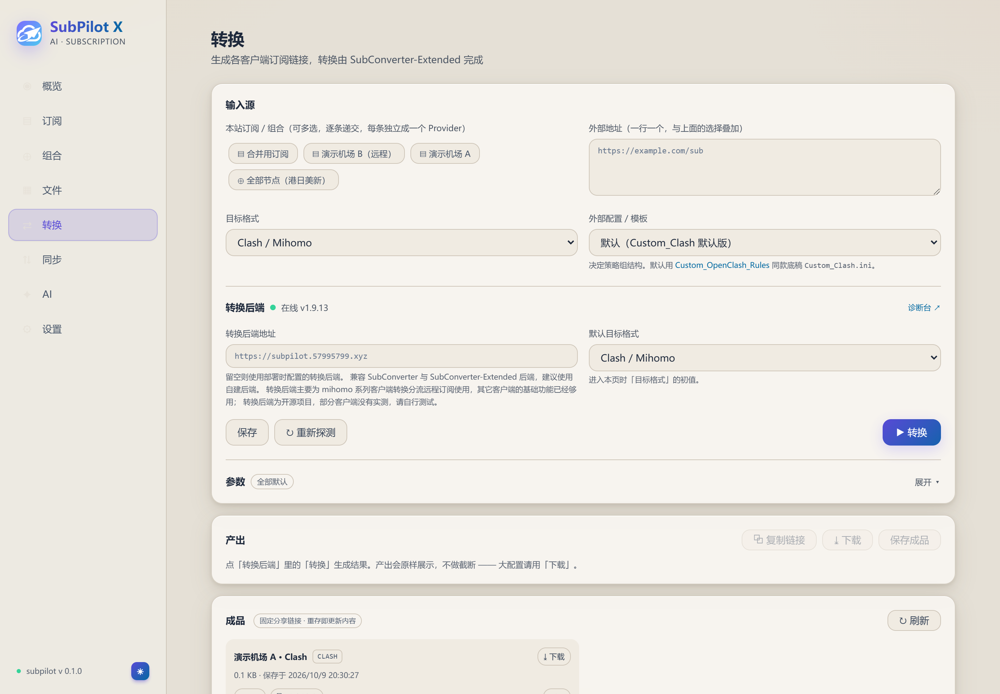
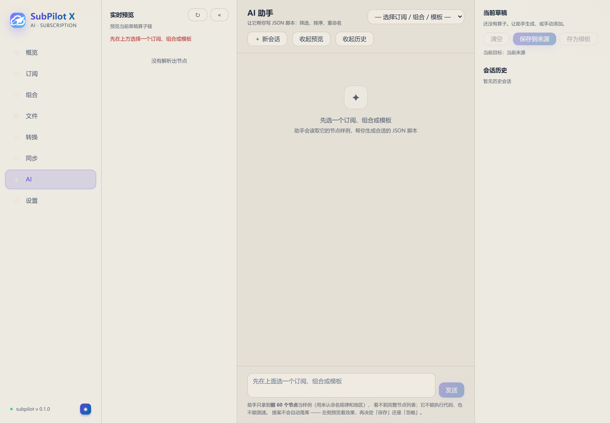

# SubPilot

面向 [SubConverter-Extended](https://github.com/Aethersailor/SubConverter-Extended)（下称 SCE）的订阅管理控制台。
界面与交互沿用前身项目 [SubPilot-Archive](https://github.com/guanxi660-crypto/SubPilot-Archive)（已归档），
但**转换层不自己实现** —— 本项目只做 SCE 不具备的那部分：**存储、节点处理、分发**。

```
浏览器 ──/api/*（Bearer 令牌）──► SubPilot 服务端
                                    ├── 存储：KV（Worker）/ SQLite（自建）
                                    ├── 节点解析 + JSON 算子链
                                    ├── /feed/*  ──► SCE ──► Clash / sing-box / Surge …
                                    └── /download/*  客户端直接拉取
```

`apps/server/src/` 是同一份代码，可部署到 **Cloudflare Worker** 或**自建 Node / Docker**
（`apps/server/node/` 是适配层）。两者接口与行为一致，只有存储形态不同。

<p align="center">
  
  
</p>
<p align="center">
  
  
</p>

## 它补上什么

SCE 是无状态的：只有 `/sub`、`/version`、`/healthz` 等少数路由，没有存储 API，
也不接受任意内联节点列表。于是：

1. **存储** —— 订阅、组合、文件、成品、分享码、设置（Worker 用 KV，自建用 SQLite）。
2. **节点处理** —— 一份 JSON 脚本描述筛选 / 排序 / 重命名等规则，在服务端执行。
3. **分发** —— 处理后的节点经 `/feed/*` 给 SCE 拉取，客户端拿 `/download/*`。

## 分发链接语义（重要）

分享 / 分发链接**只输出编辑后的订阅，不做任何格式转换**（Sub-Store 模式）：

- URI 来源 → v2ray base64 通用订阅，各客户端直接导入，也可再当转换输入；
- clash 来源 → 本地序列化的 clash YAML；
- `?target=` 参数在分发通道**被忽略**（老链接兼容）。

这样分享出去的链接不会被下游二次转换。需要特定客户端格式时，去**转换页**
（`/sub?target=xxx`）或保存成品（`/api/converted`）—— 那两条路仍走 SCE。

## 功能

| 模块 | 说明 |
| --- | --- |
| 概览 | 资源计数、转换后端状态、分发统计表 |
| 订阅 | 远程订阅 / 本地节点内容，拖拽排序；编辑页左预览右配置，改名自动同步组合引用。卡片：预览 / 复制订阅 / **下载** / 编辑 / TG / 删除 |
| JSON 脚本 | 14 种算子组成链（筛选、重命名、排序、地区置顶、去重、国旗、限量…），内联在订阅 / 组合编辑页；内置「一键整理」模板 + 自定义模板 |
| 组合 | 多个订阅合并为一个产出，可叠加组合层算子链 |
| 文件 | 规则集 / 模板 / 片段；卡片：编辑 / 下载 / 生成链接 / 分享链接 / TG |
| 转换 | 8 种目标格式（clash / sing-box / Shadowrocket / VLESS / Hysteria2 / Trojan / SS / SSR），生成分发链接与 feed 地址；多选来源同样有分发链接；成品可保存、下载、固定分享 |
| AI 助手 | 描述需求生成 JSON 脚本，SSE 流式输出；提案可预览（跑一遍管线看结果）、保存、忽略 |
| 同步 | Gist / WebDAV 备份恢复（**仅 WebDAV 目标地址**做基础私网拦截，见「已知限制」）；Telegram 推送（Bot Token 只存服务端，接口只回掩码）。**备份不含设置** —— 导出的是脱敏后的 `settings`（只剩 `hasApiKey` / `tokenSet` 之类的标记），导入也只合并订阅 / 组合 / 文件 / 成品 / 模板五张表，换机后转换后端、公开地址、TG、AI 配置都要重填 |
| 分发统计 | 记录 `/download/*` 与 `/share/*` 的拉取次数与来源 IP，可导出 CSV |

## 本地开发

```bash
npm run install:all     # 安装前后端依赖
npm run dev:server      # Worker 形态 → http://127.0.0.1:8795
npm run dev:web         # 前端 dev server → http://127.0.0.1:5175
```

打开 `http://127.0.0.1:8795`，令牌填 `dev-local-token`（见 `wrangler.dev.jsonc`）。

想跑**自建那套**（Node + SQLite，与 Docker 镜像同一份代码）：

```bash
npm run build                                   # 构建前端 → apps/web/dist
SUBPILOT_TOKEN=dev-local-token npm start        # → http://127.0.0.1:8795，数据落 apps/server/data/
```

> **改完前端要重启服务。** Worker 的 assets 清单在启动时快照，重新 build 后
> 新 hash 的 JS 会 404（`index.html` 已指向新文件，表现为白屏 + 两个 404）。

### 验证

```bash
node scripts/verify.mjs                  # 接口验证（检测到真实数据时自动跳过写入类断言）
node scripts/verify-security.mjs         # 53 项安全回归（常量时间比较 / 明文令牌 / 安全头 / 协议白名单）
node scripts/verify-regions.mjs          # 56 项地区识别回归（纯函数）
node scripts/verify-operators.mjs        # 11 项算子回归（纯函数）
node scripts/verify-presets.mjs          # 104 条配置预设与 SubPilot-Archive 逐字一致
node scripts/verify-storage.mjs          # 25 项存储层回归（直接开临时库，不走 HTTP）
node scripts/verify-converted-share.mjs  # 30 项成品分享回归
node scripts/verify-adhoc-link.mjs       # 20 项多来源分发回归
node scripts/verify-ai.mjs               # 34 项 AI 链路回归（本机起假上游，不烧真 token）
node scripts/verify-subedit-layout.mjs   # 订阅编辑页布局回归
node scripts/verify-ui-converted.mjs     # 转换页界面回归
node scripts/verify-ui.mjs               # 界面交互验证（需先跑 shots 播种）
node scripts/shots.mjs                   # 逐页截图到 shots/ + 控制台错误检查
node scripts/shot-ai.mjs                 # 只截 AI 助手页（不清库，供 dev 库里有真实数据时用）
node scripts/probe-feed.mjs              # 探针：确认「本地处理」路径下 SCE 引用的是本站 feed 地址
python scripts/gen-logo.py <原始.svg>    # 从原始图标重新生成 logo 资产（apps/web/public/）
```

`verify-*` 默认打 `http://127.0.0.1:8795`，令牌取 `SPX_TOKEN` 或 `dev-local-token`，
所以要**先起服务**；`verify-storage` / `verify-regions` / `verify-operators` / `verify-presets`
是纯函数或直接开临时库，不需要服务。

`shots.mjs` 会清空服务端资源再播种演示数据，发现白名单外条目时**直接拒绝执行**，
确认要清空才加 `SHOTS_FORCE=1`。`verify.mjs` 的写入类断言（假 AI key / TG token /
轮换分发密钥）在检测到真实数据时会自动跳过，需要强制时用 `VERIFY_FORCE_WRITE=1`。

## 部署到 Cloudflare Worker

```bash
cd apps/server
npx wrangler kv namespace create DATA -c wrangler.jsonc   # 把输出的 id 填进 wrangler.jsonc
npx wrangler secret put SUBPILOT_TOKEN -c wrangler.jsonc  # 访问令牌（未设置时受保护接口一律 401）
cd ../.. && npm run deploy                                # vite build + wrangler deploy
```

> 本项目**不能**用纯 API 单文件上传方式部署：Worker 是多模块 + `assets` 静态资源
> + KV 绑定 + secret，必须走 wrangler。

`wrangler.jsonc` 里的 `name` 必须与线上 Worker 一致 —— 改了名字 `wrangler deploy`
会**新建**一个 Worker，而自定义域仍指向旧的，表现为「部署成功但线上没变」。

**换自定义域名**：Dashboard → Worker → Settings → Domains & Routes 解绑 / 绑定即可。
注意已生成的客户端配置里嵌的是**当时请求的 host**，换域后旧的 `/feed/...`、`/download/...`
地址会失效，需要重新分发。

## 部署到 Docker / Node

同一份 `apps/server/src/`，`apps/server/node/` 把 4 个平台专有能力换掉：

| Worker 专有 | 自建替代 |
| --- | --- |
| `env.DATA`（KV） | SQLite（`node:sqlite` 内置），经 `env.STORE` 注入 |
| `env.ASSETS.fetch` | `node/assets.mjs`（ETag / SPA 回退 / 防路径穿越） |
| `ctx.waitUntil` | 吞异常的 fire-and-forget |
| `env.*` 环境变量 | 进程环境变量 |

### Docker Compose（推荐）

```bash
cp .env.example .env      # 填 SUBPILOT_TOKEN，建议 openssl rand -hex 24
docker compose up -d --build
```

打开 `http://<服务器>:8795`，数据落在宿主机 `./data`。首次启动若报
`unable to open database file`，是目录权限问题（容器以 uid 1000 运行）：

```bash
mkdir -p data && sudo chown -R 1000:1000 data
```

镜像为 `node:22-alpine` 两段构建，非 root 运行，带 `HEALTHCHECK`（探 `/healthz`）。

### 裸 Node

需要 **Node 22.5+**（`node:sqlite` 内置），无需原生编译工具链。

```bash
npm run install:all
npm run build
SUBPILOT_TOKEN='<你的令牌>' npm start
```

### 环境变量

| 变量 | 默认 | 说明 |
| --- | --- | --- |
| `SUBPILOT_TOKEN` | 空 | **访问令牌，为空时所有受保护接口 401**（fail-closed）。必填 |
| `SUB_BACKEND` | 空 | SCE 地址；留空则登录后在「转换」页配置 |
| `DB_FILE` | `apps/server/data/subpilot.db` | SQLite 文件位置 |
| `PORT` | `8795` | 监听端口 |
| `HOST` | `0.0.0.0` | 监听地址 |
| `ASSETS_DIR` | `apps/web/dist` | 前端产物目录 |

### 反向代理

`/feed/*`、`/download/*` 的地址会被写进客户端配置，取的是**请求的 origin**，
反代必须传 `X-Forwarded-Proto` 与 `X-Forwarded-Host`，否则会把内网地址写进配置。
AI 助手是 SSE 长连接，nginx 需关闭该路径的 buffering。

## 目录结构

```
apps/server/          Worker 后端
  src/                index(路由/鉴权) api convert sce pipeline operators
                      nodes feedkey ai sync telegram storage templates util
  node/               自建适配层：server.mjs / sqlite-store.mjs / assets.mjs
  wrangler.jsonc      生产配置
apps/web/             Vue 3 + Vite + Tailwind + Naive UI
  src/views components stores utils
scripts/              验证与截图脚本
Dockerfile docker-compose.yml .env.example
LICENSE (AGPL-3.0-only)  NOTICE
```

## 已知限制

以下都是**当前实现的实际行为**，不是待办清单，写出来是为了让部署者心里有数：

| 项 | 现状 | 影响 |
| --- | --- | --- |
| 令牌校验无限流 | `/api/*`、`/ai/*`、`/sub` 只有「令牌相等则放行」，没有失败计数 / 锁定 / 退避 | 弱令牌可被爆破；建议把 `SUBPILOT_TOKEN` 用 `openssl rand -hex 24` 生成 |
| 统计条目无上限 | `记录` 以 `类型\|项目\|IP` 为 key 无限累加，只有手工 `DELETE /api/stats` 才清 | KV 部署下单值逼近 25MiB 上限后会**静默停止**计数（写入失败被 `waitUntil` 吞掉）；需要定期清理 |
| 订阅正文无体积上限 | 文件限 512KiB、成品限 16MiB，但本地订阅的 `content` 没有限制 | KV 部署下超大订阅会让快照写入失败 |
| SSRF 校验覆盖面窄 | 只有 WebDAV 目标地址做了私网拦截，且**只判字面 IP**：域名解析结果、302 跳转都不复查 | `/sub?url=`、`/api/preview/*` 取源无防护。**自建部署请勿暴露到公网**，或在外层反代/防火墙限制出网 |
| 来源 IP 可伪造 | `clientIp()` 信任 `CF-Connecting-IP` → `X-Real-IP` → `X-Forwarded-For` | 自建部署下分发统计的 IP 维度不可信。Cloudflare 部署下这些头由平台覆写，不受影响 |
| 并发写无乐观锁 | `mutate()` 是「读整份 → 改 → 写回」，没有版本号 | 同一瞬间的两个写操作，后写的覆盖先写的且不报错。单用户面板概率低 |
| 备份不含设置 | 见上表「同步」行 | 换机恢复后需重填转换后端 / 公开地址 / TG / AI 配置 |
| 无 CSP | 只加了 `nosniff` / `X-Frame-Options` / `Referrer-Policy` | 前端大量内联 style，收紧 `style-src` 会直接打坏布局，需要单独评估 |

安全响应头的落地方式分两处，改的时候别漏：**Worker 生成的响应**由
`apps/server/src/index.js` 的 `withSecurityHeaders()` 加；**静态资源**（`index.html`、
`/assets/*`）由 Cloudflare 边缘直接返回、根本不进 Worker，所以走 `apps/web/public/_headers`。
本地 Node 部署两者都经 Worker，看不出这个差别。

## 关于默认转换后端

仓库中 `SUB_BACKEND` 指向作者自建的 SCE 实例，**公益免费提供**，不承诺可用性、
稳定性与实时性，请勿滥用；长期使用或对稳定性有要求时请换自建后端。

## 许可

AGPL-3.0-only，见 [LICENSE](LICENSE)。第三方组件与出处见 [NOTICE](NOTICE)。
